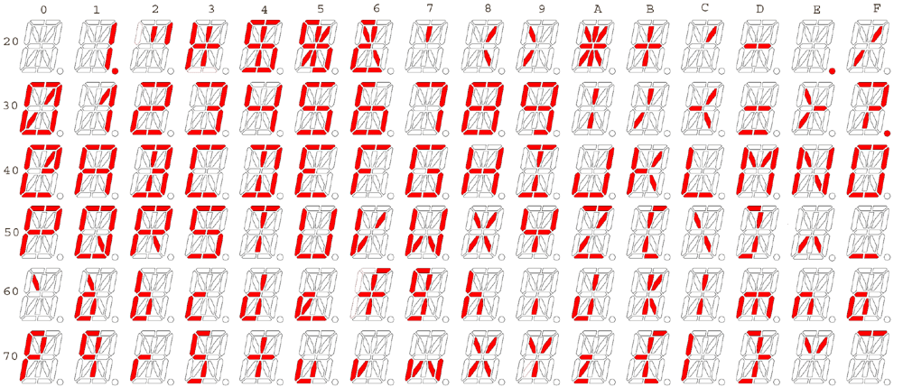

# seven-segment-display


Create a program to create a seven segment display, commonly seen on many older electronic devices.

It must work with at least these two different inputs:
 
Input

- 1
```
123456789
433805825
526837608
954105592
```
- 2
```
122372789
434505825
526837608
953847592
```

Output:

```
    _  _     _  _  _  _  _ 
  | _| _||_||_ |_   ||_||_|
  ||_  _|  | _||_|  ||_| _|

    _  _  _  _  _  _  _  _ 
|_| _| _||_|| ||_ |_| _||_ 
  | _| _||_||_| _||_||_  _|

 _  _  _  _  _  _  _  _  _ 
|_  _||_ |_| _|  ||_ | ||_|
 _||_ |_||_| _|  ||_||_||_|

 _  _        _  _  _  _  _ 
|_||_ |_|  || ||_ |_ |_| _|
 _| _|  |  ||_| _| _| _||_  
```
 
# further

Using only the output, decode the string into the input.


# further
Create the same for a 16-segment display:\



Input

```
123456789
433805825
526837608
954105592
The quick brown fox jumps over the lazy dog
```
